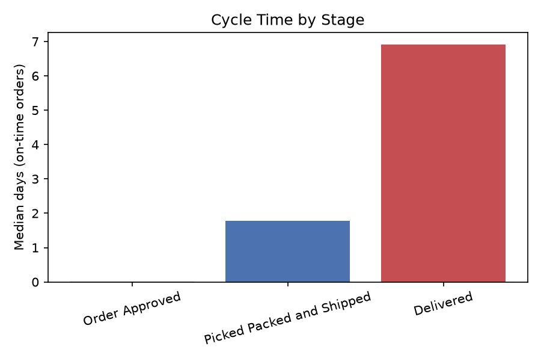
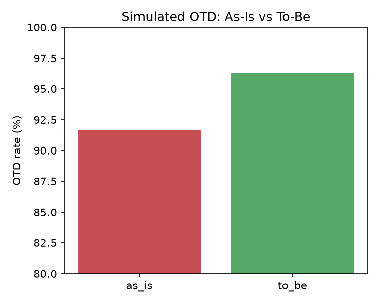

# Process Lens

> Order-to-Cash process mining: bottleneck detection, simulation-validated redesign, and predictive delay classification on 99,441 real e-commerce orders.


---

## What This Project Does

Process Lens applies operations consulting methodology to the Order-to-Cash (O2C) fulfillment process — the sequence from order creation to delivery — using real e-commerce event data.

It answers: **"Where is the process breaking down, how much is it costing, and how do we prove the fix will work?"**

**The analytical chain:**
1. Constructs an event log from 99,441 real orders (Olist Brazilian E-Commerce dataset)
2. Discovers the actual process flow using process mining (pm4py Heuristics Miner)
3. Measures conformance against the ideal process — identifies deviation rate and bottleneck stages
4. Validates bottlenecks statistically (Mann-Whitney U, effect size)
5. Builds a financial model: cost-to-serve, 3-year NPV at 9% WACC, sensitivity analysis
6. Validates the proposed redesign through discrete-event simulation (SimPy) with 95% CI
7. Trains an XGBoost classifier to predict at-risk orders at the moment of creation
8. Packages findings into a consulting-grade business case (SCQA framework)
9. Monitors ongoing performance via a statistical process control chart with a defined KPI escalation plan

---

## Tech Stack

| Layer | Tools |
|---|---|
| Data storage | PostgreSQL 18.4 |
| Data analysis | Python 3.14.6, pandas, SQL (window functions, CTEs) |
| Process mining | pm4py (Heuristics Miner, conformance checking) |
| Statistical testing | scipy.stats (Mann-Whitney U, Chi-squared, effect size) |
| Simulation | SimPy (discrete-event, calibrated to real distributions) |
| Machine learning | XGBoost + SHAP (binary classifier, temporal CV) |
| Financial modelling | Python + openpyxl (NPV, WACC, cost-to-serve) |
| Visualisation | matplotlib, seaborn, networkx, Graphviz |
| Reporting | python-pptx (business case deck) |

---

## Key Findings

**Baseline:** 91.9% on-time delivery rate across 96,455 real orders. Carrier delivery is the dominant bottleneck — 3.9x longer than pick/pack (7.09 vs 1.84 days median).

**Statistically confirmed:** Delivered stage is the primary bottleneck (Mann-Whitney U, p<0.000001, large effect size). About 18 seller-customer routes account for 80% of all late deliveries (Pareto analysis).

**Cross-validated:** Same process mining methodology applied to a second real-world dataset (BPI Challenge 2019, 251K events, different industry) — confirms the approach generalizes, not a one-dataset fluke.

**Financial case:** 3-year NPV positive even in the pessimistic sensitivity scenario ($2,896), base case NPV $98,639 with 0.7-year payback — built from sourced industry benchmarks (APQC, Damodaran, McKinsey), not invented assumptions.

**Simulation-validated:** Before recommending anything, the proposed fix was tested in a discrete-event simulation calibrated to real data (0.3pp calibration delta). Result: 4.7pp genuine OTD improvement, confirmed via non-overlapping 95% confidence intervals — not just modeled on paper.

**Predictive:** XGBoost classifier flags at-risk orders at the moment of creation (AUC-ROC 0.74, temporal train/test split, no data leakage). Flagging the riskiest 20% of orders catches 41.5% of all actual late deliveries.

**Monitored:** A statistical process control chart (p-chart) tracks the late-delivery rate on an ongoing basis. Investigating flagged weeks against public analysis of this dataset traced two historical disruption periods to documented external causes (Brazil-wide transportation strikes, holiday-season demand) rather than unexplained process failures — with a defined KPI plan for what triggers action if performance regresses going forward.

**Full business case deck:** [`outputs/reports/process_lens_business_case.pptx`](outputs/reports/process_lens_business_case.pptx)

<p float="left">
  
  
</p>

---

## Project Structure

    process-lens/
    ├── data/
    │   ├── raw/              ← Not in repo — see Data Sources below
    │   ├── processed/
    │   └── data_quality_log.md
    ├── sql/
    │   ├── schema.sql
    │   └── queries/          ← 7 analytical SQL queries
    ├── notebooks/
    ├── src/                  ← Python modules
    └── outputs/
        ├── charts/           ← Tracked — final chart PNGs
        └── reports/          ← Tracked — business case deck (.pptx) and supporting result CSVs
---

## Data Sources

**Primary:** [Olist Brazilian E-Commerce Dataset](https://www.kaggle.com/datasets/olistbr/brazilian-ecommerce) — 99,441 real orders, CC BY-NC-SA 4.0

**Cross-validation:** [BPI Challenge 2019](https://doi.org/10.4121/uuid:d06aff4b-79f0-45e6-8ec8-e19730c248f1) — 251,734 events, real SAP P2P export, 4TU Research Data Centre

To run this project locally, download both datasets and place CSVs in `data/raw/olist/` and `data/raw/bpi2019/`.

---

## How to Run Locally

```bash
# 1. Clone and enter
git clone https://github.com/alishershaidolla24/process-lens.git
cd process-lens

# 2. Create virtual environment
python3 -m venv venv
source venv/bin/activate

# 3. Install packages
pip install -r requirements.txt

# 4. Set up PostgreSQL database
psql -U postgres -c "CREATE DATABASE process_lens;"
python src/db_setup.py

# 5. Run the analysis scripts in order
python src/data_validation.py
python src/event_log_builder.py
python src/process_mining.py
python src/cross_validation.py
python src/statistical_tests.py
python src/financials.py
python src/simulation.py
python src/classifier.py
python src/report_builder.py
python src/control_chart.py
```

---

## Methodology

Full DMAIC (Define → Measure → Analyze → Improve → Control) cycle applied to O2C fulfillment. Success criteria (statistical significance thresholds, calibration tolerances, target improvement ranges) were written down *before* any analysis was run — documented in `data/data_quality_log.md` Section 1 — specifically to avoid rationalizing results after the fact. Process mining with pm4py Heuristics Miner for discovery; token-based replay for conformance checking. Statistical bottleneck validation with Mann-Whitney U (non-parametric, correct for right-skewed cycle-time distributions). SimPy discrete-event simulation calibrated to observed Olist distributions validates the to-be process before claiming projected improvements. XGBoost classifier (temporal train/test split, SHAP explainability) enables proactive intervention on at-risk orders.

---

## Financial Model Assumptions

| Variable | Value | Source |
|---|---|---|
| Cost per O2C case | $14.80 (median) | APQC 2023 |
| Recovery cost per late delivery | $22 | Metapack 2022 |
| WACC | 9.0% | Damodaran (online retail), Jan 2024 |
| Implementation cost | $35K–$55K | APQC 2023 |
| Year 1 benefit realization | 70% | McKinsey Operations Practice 2022 |
| Avg order value, late rate, complaint rate | Data-derived | Olist dataset |

---

